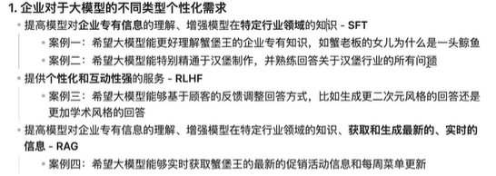
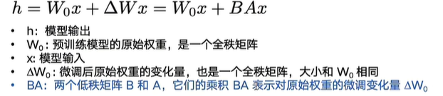
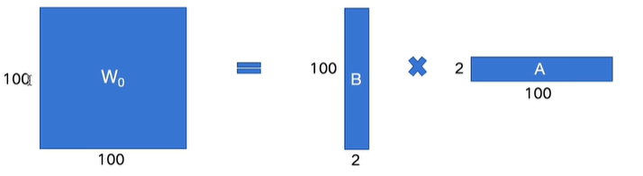
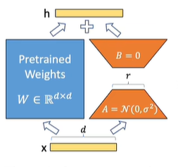
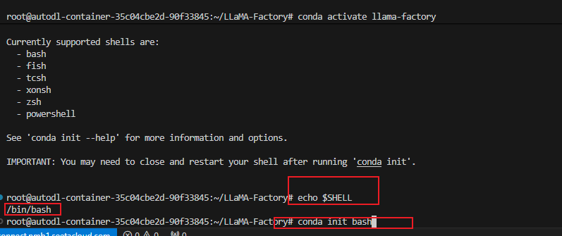
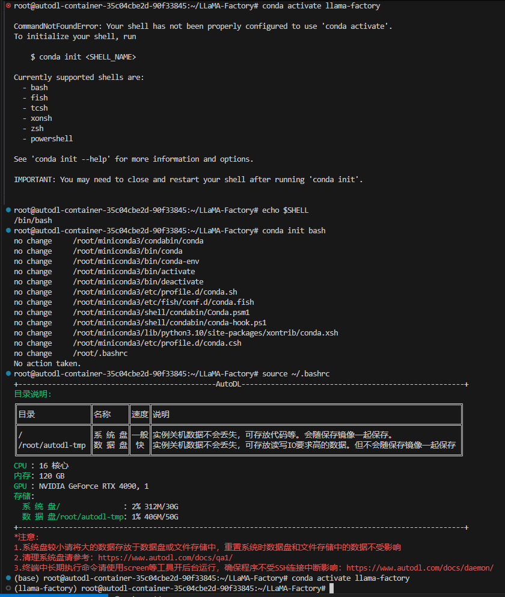

# 企业对大模型需求

> **SFT（Supervised Fine-Tuning）有监督微调  RLHF（Reinforcement Learning from Human Feedback）强化学习   RAG**
>
> 

##### RLHF 

- DPO (direct preference optimization)

  直接通过人类的对比选择直接优化生成模型，调整范围比较大（比如给你两个回答看你选哪个）

- PPO（proximal policy optimization）

​		通过奖励信号（点赞，点踩）来渐进式调整

Full Fine-Tuning

Partial Fine-Tuning

LORA微调 冻结了整个模型的权重

矩阵的秩（Rank of matrix）：是指矩阵中线性无关的行或列的最大数量。简单来说他能反映矩阵所包含的全部有效信息量。

Lora的核心：用BA存储，也就是大矩阵的低秩分解

Lora论文中只使用Lora微调了注意力机制的权重？

必读论文 Attention is all you need    /    Lora

遇到的有关conda activate不能用的问题

如果autodl上不能用git

就 

$ git config --global --unset http.https://github.com.proxy

$ git config --global --unset https.https://github.com.proxy

